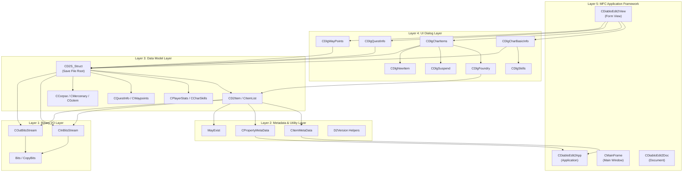
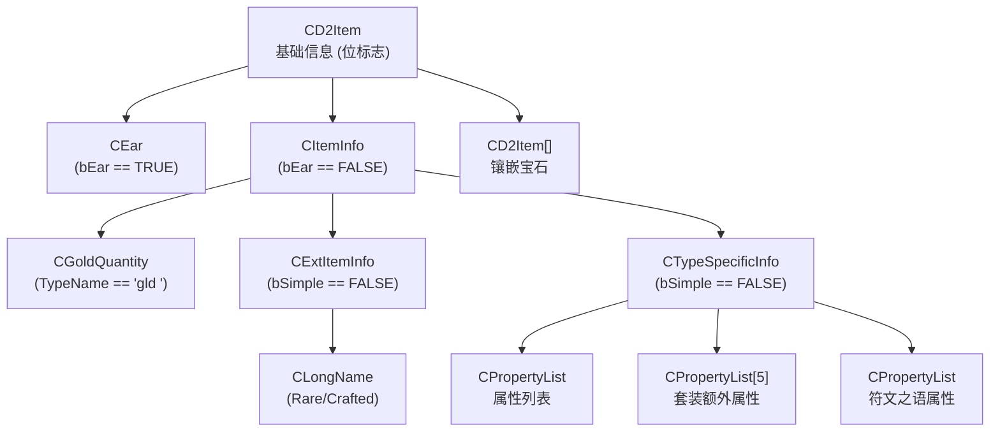
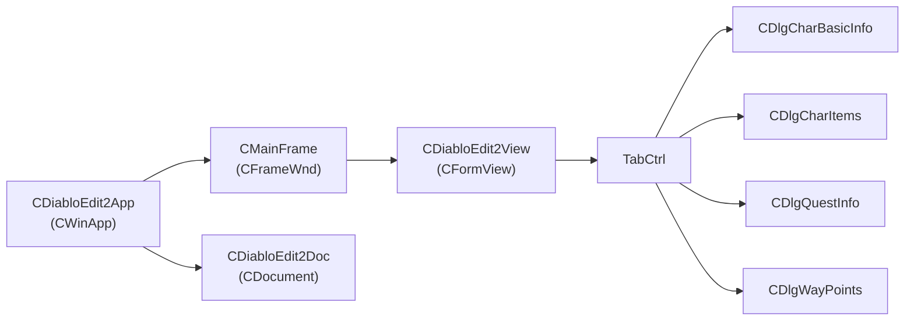
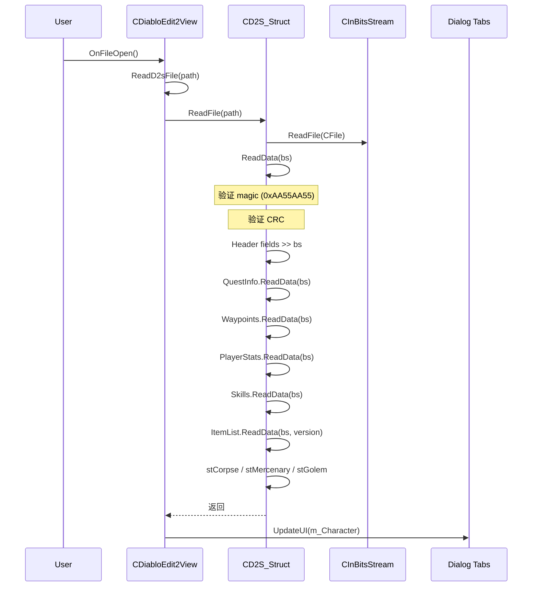
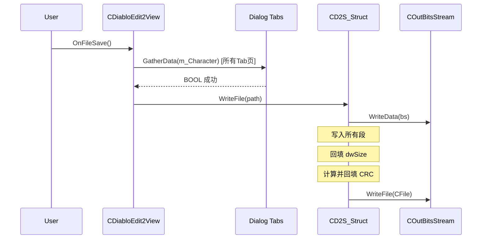
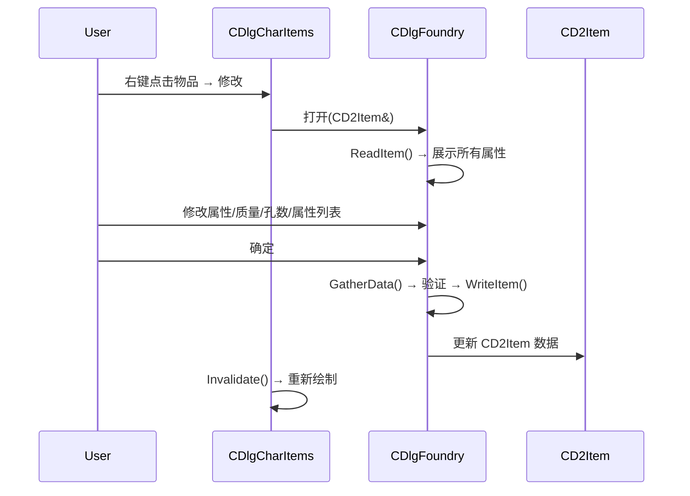

# Diablo Edit2 — 架构与设计文档

> **项目定位**: Diablo II / Diablo II: Resurrected 角色存档编辑器 (.d2s 文件)
> **技术栈**: C++ / MFC (Microsoft Foundation Classes) / Visual Studio 2017
> **支持版本**: 1.09 (0x57), 1.10 (0x60), D2R (0x61), PTR 2.4 (0x62), PTR 2.5/2.6 (0x63)

---

## 1. 项目总览

### 1.1 解决方案结构

解决方案文件 `暗黑II.sln` 包含两个项目：

| 项目 | 说明 |
|------|------|
| **Diablo Edit2** | 主编辑器程序（MFC GUI 应用） |
| **Generate Data** | 辅助工具，将 `.txt` 元数据编译为 QuickLZ 压缩的 `.dat` 文件 |

### 1.2 目录结构

```
diablo_edit/
├── 暗黑II.sln                    # Visual Studio 解决方案
├── Diablo Edit2/                  # 主项目
│   ├── *.h / *.cpp                # 源代码
│   ├── DiabloEdit2.rc / resource.h # MFC 资源文件 (对话框、菜单、工具栏)
│   ├── Pictcures/                 # 物品图片 BMP 资源 (376 张)
│   ├── res/                       # 应用图标等资源
│   ├── Design/                    # 设计文档
│   ├── itemdata.dat               # 物品元数据 (压缩)
│   ├── property.dat               # 属性元数据 (压缩)
│   ├── language.dat               # 多语言字符串 (压缩)
│   └── new.dat                    # 新建角色模板 (压缩)
├── Generate Data/                 # 数据生成工具
│   ├── main.cpp                   # 入口：读取 .txt → 压缩 → 输出 .dat
│   ├── quicklz.c.h / quicklz.h   # QuickLZ 压缩库
│   ├── compress_quicklz.h         # 压缩封装
│   ├── itemdata.txt               # 物品元数据源文件
│   ├── property.txt               # 属性元数据源文件
│   └── language.txt               # 多语言字符串源文件
└── x64/                           # 构建输出
```

---

## 2. 架构分层

整体架构可分为 **5 层**，从底向上依次为：



---

## 3. 各层详细设计

### 3.1 Layer 1: 二进制 I/O 层 — [BinDataStream.h](file:///d:/github/zhaopuming/diablo_edit/Diablo%20Edit2/BinDataStream.h)

D2S 文件格式大量使用**非字节对齐的比特级字段**。本层提供位级读写流，是所有数据解析的基础。

#### 核心类

| 类名 | 说明 |
|------|------|
| `CInBitsStream` | 输入比特流。支持字节读 (`>>`) 和位读 (`>> bits(v, n)`) |
| `COutBitsStream` | 输出比特流。支持字节写 (`<<`) 和位写 (`<< bits(v, n)`) |
| `Bits<T>` | 模板包装器，将一个值与其位宽绑定 |
| `OffsetValue<T>` | 允许回写到流中的指定偏移（用于 CRC 和 Size 回填） |

#### 关键操作

- **字节读写**: `bs >> DWORD/WORD/BYTE` — 直接内存拷贝 (little-endian)
- **位读写**: `bs >> bits(value, n)` — 从当前位偏移读取 n 个 bit
- **字节对齐**: `AlignByte()` — 跳过当前字节中的剩余位
- **模式搜索**: `SkipUntil(pattern)` — 跳过数据直到找到 magic 字节序列
- **偏移回写**: `bs << offset_value(offset, value)` — 在已有流中的指定偏移处覆写数据

#### 设计细节

```
内部状态: data_[] (BYTE向量), bytes_ (当前字节偏移), bits_ (当前位偏移 0-7)

位偏移计算:
  bytes_ += (bits_ + n) / 8
  bits_  =  (bits_ + n) % 8

CopyBits() 函数负责跨字节边界的位拷贝
```

### 3.2 Layer 2: 元数据与工具层

#### 3.2.1 `MayExist<T, N>` — [MayExist.h](file:///d:/github/zhaopuming/diablo_edit/Diablo%20Edit2/MayExist.h)

D2S 格式中大量字段为**条件存在**（如 "如果 bSocketed == TRUE，则存在 iSocket 字段"）。`MayExist` 是一个**可选值容器**，类似 `std::optional`，但针对 D2S 场景做了特化优化。

| 特化 | 存储方式 | 用途 |
|------|---------|------|
| `MayExist<T, 1>` (通用) | `std::vector<T>` (0或1个元素) | 可选的复合结构 (如 `CEar`, `CExtItemInfo`) |
| `MayExist<BYTE, 1>` / `MayExist<WORD, 1>` | POD 值 + bool标志 | 可选的基本类型字段；支持 `Bits<>` 流式读写 |
| `MayExist<T, N>` (N>1) | `std::vector<T>` (0或N个元素) | 固定大小可选数组 (如套装属性标志 `MayExist<BOOL, 5>`) |

核心接口：
- `ensure()` — 确保存在，不存在则创建
- `exist()` — 判断是否存在
- `reset()` — 清空

#### 3.2.2 `CItemMetaData` — [MetaData.h](file:///d:/github/zhaopuming/diablo_edit/Diablo%20Edit2/MetaData.h)

物品的**静态描述**数据，从 `itemdata.dat` 加载。每种物品类型有一条记录：

```
sTypeName[4]  — 物品类型ID (如 "elx ", "hax ")，作为唯一标识
PicIndex      — 图片资源索引
NameIndex     — 名称字符串索引
Equip         — 可穿戴位置 (头/项链/身体/武器/戒指/腰/鞋/手套/腰带)
Range         — 网格大小
HasDef        — 有防御值
HasDur        — 有耐久度
IsStacked     — 有数量
IsCharm       — 是护身符
...
```

`CDiabloEdit2App` 中维护一个 `unordered_map<DWORD, pair<UINT,UINT>>` 来实现 **TypeID → 元数据** 的快速查找。

#### 3.2.3 `CPropertyMetaData` — [MetaData.h](file:///d:/github/zhaopuming/diablo_edit/Diablo%20Edit2/MetaData.h)

属性的**位宽和取值范围**描述，从 `property.dat` 加载。支持**按版本区分**：

```
CPropertyMetaData → 包含 list<CPropertyMetaDataItem>
CPropertyMetaDataItem → 包含 vector<CPropertyField>
CPropertyField { bits, base, min, max }
```

通过 `findData(version)` 获取与当前存档版本匹配的属性定义。

#### 3.2.4 D2 版本判断 — [D2Version.h](file:///d:/github/zhaopuming/diablo_edit/Diablo%20Edit2/D2Version.h)

```cpp
IsD2R(ver)              → ver >= 0x61  // D2 Resurrected
IsPtr24AndAbove(ver)    → ver >= 0x62  // PTR 2.4+
IsPtr25AndAbove(ver)    → ver >= 0x63  // PTR 2.5+
IsValidVersion(ver)     → 白名单: 0x47, 0x57, 0x59, 0x5C, 0x60, 0x61, 0x62, 0x63
```

### 3.3 Layer 3: 数据模型层 — D2S 存档结构

#### 3.3.1 `CD2S_Struct` — 存档文件根结构 — [D2S_Struct.h](file:///d:/github/zhaopuming/diablo_edit/Diablo%20Edit2/D2S_Struct.h)

这是整个 D2S 文件的**顶层结构**，包含角色的所有数据。字段按文件中的顺序排列：

```
┌──────────────────────────────────────────────────┐
│ File Header (固定结构)                            │
│  dwMajic (0xAA55AA55) │ dwVersion │ dwSize       │
│  dwCRC │ dwWeaponSet                             │
├──────────────────────────────────────────────────┤
│ Character Info (固定结构)                         │
│  Name[16] │ charType │ charTitle │ charClass     │
│  charLevel │ dwTime │ dwSkillKey[16]             │
│  dwLeftSkill1/2 │ dwRightSkill1/2               │
│  outfit[16] │ colors[16] │ Town[3]              │
│  dwMapSeed │ 雇佣兵信息 │ NamePTR[64] (PTR2.4+)  │
├──────────────────────────────────────────────────┤
│ CQuestInfo      — 任务完成信息 (3个难度 × 各Act任务) │
├──────────────────────────────────────────────────┤
│ CWaypoints      — 小站信息 (3个难度 × 各小站)       │
├──────────────────────────────────────────────────┤
│ NPC[0x34]       — NPC 交谈信息                     │
├──────────────────────────────────────────────────┤
│ CPlayerStats    — 人物属性 (力量/敏捷/能量/体力等)   │
├──────────────────────────────────────────────────┤
│ CCharSkills     — 技能等级 (30个技能)               │
├──────────────────────────────────────────────────┤
│ CItemList       — 物品列表                         │
├──────────────────────────────────────────────────┤
│ CCorpse         — 尸体 (含装备列表)                 │
├──────────────────────────────────────────────────┤
│ CMercenary      — 雇佣兵 (含装备列表, 仅资料片)      │
├──────────────────────────────────────────────────┤
│ CGolem          — 钢铁石魔 (仅资料片)               │
└──────────────────────────────────────────────────┘
```

**读写流程**:
1. `ReadFile(path)` → 打开 CFile → 构造 `CInBitsStream` → `ReadData(bs)`
2. `ReadData(bs)` 按顺序读取各段，每段校验 magic number，失败则 `throw CString`
3. `WriteData(bs)` 按相同顺序写入 → 回填 `dwSize` 和 `dwCRC` → `WriteFile()` 输出

**CRC 算法**:
```cpp
// 每字节累加，带进位的左移
for (i = 0; i < len; ++i)
    add = (init & 0x80000000 ? 1 : 0) + source[i];
    init = (init << 1) + add;
```

#### 3.3.2 `CPlayerStats` — 人物属性

使用**变长编码**：每个属性由 9-bit ID + 可变位宽的 Value 组成，以 0x1FF 结束。

```
属性ID → 位宽映射:
  0-4 (Str/Ene/Dex/Vit/StatPts): 10 bits
  5   (SkillPts):                  8 bits
  6-B (Life/Mana/Stamina):        21 bits (值 ÷ 256)
  C   (Level):                     7 bits
  D   (Experience):               32 bits
  E-F (Gold):                     25 bits
```

#### 3.3.3 `CD2Item` — 物品数据模型 — [D2Item.h](file:///d:/github/zhaopuming/diablo_edit/Diablo%20Edit2/D2Item.h)

物品是最复杂的数据结构，采用**层层嵌套的条件结构**：



**关键位标志** (CD2Item 成员):

| 位 | 字段 | 说明 |
|----|------|------|
| 20 | `bIdentified` | 是否已辨识 |
| 27 | `bSocketed` | 是否有孔 |
| 32 | `bEar` | 是否为耳朵 (PK 战利品) |
| 37 | `bSimple` | 是否简单物品 (无扩展属性) |
| 38 | `bEthereal` | 是否无形 |
| 40 | `bPersonalized` | 是否个性化 |
| 42 | `bRuneWord` | 是否符文之语 |

**物品质量** (`iQuality` in `CExtItemInfo`):

| 值 | 质量 | 颜色 | 额外数据 |
|----|------|------|---------|
| 1 | Low Quality | 白 | 3-bit sub-type |
| 2 | Normal | 白 | — |
| 3 | High Quality | 白 | 3-bit sub-type |
| 4 | Magic | 蓝 | 11-bit prefix + 11-bit suffix |
| 5 | Set | 绿 | 12-bit Set ID |
| 6 | Rare | 黄 | CLongName (前缀/后缀组合) |
| 7 | Unique | 暗金 | 12-bit Unique ID |
| 8 | Crafted | 橙 | CLongName |

**Huffman 编码**: 在非 D2R 版本中，物品名称字符使用 Huffman 树进行压缩编码（见 `D2Item.cpp` 中的 `HuffmanTree` 类）。

#### 3.3.4 `CItemList` — 物品列表

```cpp
struct CItemList {
    WORD    wMajic;     // 0x4D4A ("JM")
    vector<CD2Item> vItems;  // 所有物品（不含镶嵌宝石，宝石存在各物品的 aGemItems 中）
    WORD    wEndMajic;  // 0x4D4A ("JM")
};
```

每个物品自带 `iLocation`/`iPosition`/`iStoredIn` 来表示存放位置（装备、背包、仓库、赫拉迪卡方块）。

### 3.4 Layer 4: UI 对话框层

所有角色编辑页面继承自 `CCharacterDialogBase`，定义了统一接口：

```cpp
class CCharacterDialogBase : public CDialog {
    virtual void UpdateUI(const CD2S_Struct& character) = 0;  // 数据 → UI
    virtual BOOL GatherData(CD2S_Struct& character) = 0;       // UI → 数据
    virtual void ResetAll() = 0;                                // 清空 UI
    virtual void LoadText() = 0;                                // 加载语言文本
};
```

#### 对话框一览

| 类名 | 功能 | 关键特性 |
|------|------|---------|
| `CDlgCharBasicInfo` | 角色基础信息 | 姓名、等级、职业、属性点、经验值、金币；内嵌子 Tab 页 |
| `CDlgCharItems` | 角色装备管理 | **最复杂的对话框**：网格系统、拖放、右键菜单、物品图片渲染、悬浮信息窗 |
| `CDlgQuestInfo` | 任务完成状态 | 3个难度 × 29个任务的 checkbox 矩阵 |
| `CDlgWayPoints` | 小站激活状态 | 3个难度 × 40个小站 |
| `CDlgSkills` | 技能等级编辑 | 3棵技能树 × 10个技能 |
| `CDlgFoundry` | **物品铸造台** | 修改物品的所有详细属性：质量、防御、耐久度、孔数、属性列表 |
| `CDlgSuspend` | 物品信息悬浮窗 | 半透明窗口，显示物品属性，类似游戏内 Tooltip |
| `CDlgNewItem` | 创建新物品 | 树形分类选择组件 |
| `CDlgSelectChar` | 新建角色选择 | 简单下拉选择职业 |

#### `CDlgCharItems` 网格系统设计

这是最复杂的 UI 组件，使用自定义网格视图系统：

```
CItemView — 物品的视图表示
  ├── Item (CD2Item)         — 物品数据
  ├── nPicRes                — BMP 图片资源索引
  ├── iEquip / iPosition     — 装备位置
  ├── iGridX / iGridY        — 网格坐标
  ├── iGridWidth/iGridHeight — 大小
  └── vGemItems              — 镶嵌宝石索引

GridView — 网格位置的视图
  ├── vItemIndex[]           — 每个网格单元存储的物品索引
  ├── Rect                   — 屏幕位置
  ├── iEquip                 — 可装备类型
  └── PutItem()              — 放置物品逻辑（检查空间、类型兼容性）
```

鼠标交互流程：
1. `OnLButtonDown` → `HitTestPosition()` 确定点击的网格位置
2. 如果手中无物品且点击含物品 → 拾起物品，创建 Alpha 光标
3. 如果手中有物品 → `PutItemInGrid()` 尝试放置，检查交换
4. `OnMouseMove` → 更新悬浮信息窗 (`CDlgSuspend`)
5. 右键菜单 → 导入/导出/复制/粘贴/修改/创建/删除物品

### 3.5 Layer 5: MFC 应用框架层

#### SDI 架构



> [!IMPORTANT]
> 本项目的 `CDocument` 类 (`CDiabloEdit2Doc`) **几乎未被使用**。实际的文件读写逻辑全部在 `CDiabloEdit2View` 中。`View` 直接持有 `CD2S_Struct m_Character` 成员，绕过了 MFC 标准的 Document-View 分离模式。

#### `CDiabloEdit2App` — 全局单例

这是应用程序的核心枢纽，作为全局单例 (`theApp`) 管理：
- **多语言系统**: `m_saLanguage` 二维向量存储所有语言的字符串，`m_nLangIndex` 控制当前语言
- **物品元数据**: `m_vItemMetaData` (按分类组织) + `m_mIdToMetaData` (TypeID → 位置索引)
- **属性元数据**: `m_vPropertyMetaData` (按 ID 索引)
- **字符串查找**: 通过 `LangSection` 枚举和段基址 (`m_aLangBases`) 实现分段索引

#### `CDiabloEdit2View` — 主视图

核心数据流：

```
File Open → ReadD2sFile() → CD2S_Struct::ReadFile()
                          → TabPage[i]->UpdateUI(character)

File Save → TabPage[i]->GatherData(character)
          → CD2S_Struct::WriteFile()
```

---

## 4. 数据生成管线

`Generate Data` 项目是一个独立的命令行工具：

```
language.txt  ──→ QuickLZ 压缩 ──→ language.dat
itemdata.txt  ──→ QuickLZ 压缩 ──→ itemdata.dat
property.txt  ──→ QuickLZ 压缩 ──→ property.dat
```

**运行时加载流程** (`CDiabloEdit2App::InitInstance`):
1. `ReadLangRes()` → 从嵌入资源加载 `language.dat` → 解压 → 解析为 `m_saLanguage`
2. `ReadItemRes()` → 加载 `itemdata.dat` → 解压 → 解析为 `m_vItemMetaData`
3. `ReadPropRes()` → 加载 `property.dat` → 解压 → 解析为 `m_vPropertyMetaData`
4. `ReadNewChar()` → 加载 `new.dat` → 解压 → 解析为 `m_stNewCharacter`

语言文件格式 (Tab 分隔的文本文件):
- 第1行: `*LANG` 文件标识
- `*SectionName` 行: 段标题
- 数据行: `[索引]\t[英文]\t[繁体中文]\t[简体中文]`

---

## 5. 多语言系统

支持 3 种语言：English / 繁體中文 / 简体中文

### 架构

```
m_saLanguage: vector<vector<CString>>
  [0] = {"English", "繁體中文", "简体中文", ...所有英文字符串...}
  [1] = {"English", "繁體中文", "简体中文", ...所有繁体字符串...}
  [2] = {"English", "繁體中文", "简体中文", ...所有简体字符串...}

m_aLangBases: vector<UINT>
  段基址数组，通过 SectionToIndex(section, index) 计算绝对索引
  实际索引 = m_aLangBases[section] + index
```

语言段 (`LangSection` 枚举) 涵盖：
- 游戏数据：符文之语 / 套装 / 暗金 / 魔法前后缀 / 怪物 / 属性 / 物品 / 城镇 / 角色 / 技能 / 任务 / 小站
- UI 文本：菜单 / 弹出菜单 / 对话框标签 / 消息框 / 提示信息
- 切换方式：菜单 View → Language，调用 `LoadText()` 刷新所有控件

---

## 6. 关键数据流

### 6.1 打开文件流程



### 6.2 保存文件流程



### 6.3 物品编辑流程



---

## 7. 扩展指南

### 7.1 添加对新版本的支持

1. 在 [D2Version.h](file:///d:/github/zhaopuming/diablo_edit/Diablo%20Edit2/D2Version.h) 中添加版本判断函数和白名单
2. 在 [D2S_Struct.cpp](file:///d:/github/zhaopuming/diablo_edit/Diablo%20Edit2/D2S_Struct.cpp) 的 `ReadData`/`WriteData` 中处理新版本的结构差异
3. 在 [D2Item.cpp](file:///d:/github/zhaopuming/diablo_edit/Diablo%20Edit2/D2Item.cpp) 中处理物品格式的版本差异
4. 如有新属性，需更新 `property.txt` 并重新生成 `property.dat`

### 7.2 添加新的物品类型

1. 编辑 `Generate Data/itemdata.txt` 添加物品定义
2. 运行 `Generate Data` 项目重新生成 `itemdata.dat`
3. 如果需要新图片，添加 BMP 到 `Pictcures/` 并更新资源文件

### 7.3 添加新语言

1. 编辑 `Generate Data/language.txt` 添加新语言列
2. 运行 `Generate Data` 项目重新生成 `language.dat`
3. 在 [Diablo Edit2View.h](file:///d:/github/zhaopuming/diablo_edit/Diablo%20Edit2/Diablo%20Edit2View.h) 和 `.cpp` 中添加 `OnLanguageN` / `OnUpdateLanguageN` 方法
4. 在菜单资源中添加语言选项

### 7.4 添加新的编辑功能

1. 如果是新 Tab 页：创建继承 `CCharacterDialogBase` 的新对话框类，实现 4 个虚函数
2. 在 `CDiabloEdit2View::InitUI()` 中注册新 Tab
3. 如果是修改现有功能：在对应的 `DlgXxx` 类中添加控件和消息处理

---

## 8. 设计模式与技法总结

| 模式/技法 | 应用 |
|-----------|------|
| **全局单例** | `CDiabloEdit2App theApp` 作为元数据中心 |
| **模板方法** | `CCharacterDialogBase` 定义 `UpdateUI/GatherData/ResetAll/LoadText` 接口 |
| **流式读写** | `CInBitsStream`/`COutBitsStream` 通过 `>>` / `<<` 操作符链式读写 |
| **可选值容器** | `MayExist<T>` 处理条件存在的字段 |
| **数据驱动** | 物品/属性/语言全部通过外部数据文件定义，运行时加载 |
| **版本策略** | `D2Version.h` 中的版本判断函数，各 `ReadData` 中按版本分支处理 |
| **Huffman 编码** | 物品名称在非 D2R 版本中使用 Huffman 压缩通信 |
| **CRC 完整性** | 自定义 CRC 算法验证存档完整性，写入时回填 |

---

## 9. 文件索引

### 核心数据文件

| 文件 | 职责 | 行数 |
|------|------|------|
| [D2S_Struct.h](file:///d:/github/zhaopuming/diablo_edit/Diablo%20Edit2/D2S_Struct.h) | D2S 存档格式定义（根结构 + 子结构） | 238 |
| [D2S_Struct.cpp](file:///d:/github/zhaopuming/diablo_edit/Diablo%20Edit2/D2S_Struct.cpp) | 存档读写实现 | 347 |
| [D2Item.h](file:///d:/github/zhaopuming/diablo_edit/Diablo%20Edit2/D2Item.h) | 物品数据模型 | 267 |
| [D2Item.cpp](file:///d:/github/zhaopuming/diablo_edit/Diablo%20Edit2/D2Item.cpp) | 物品读写 + Huffman 编解码 | 851 |
| [BinDataStream.h](file:///d:/github/zhaopuming/diablo_edit/Diablo%20Edit2/BinDataStream.h) | 位级二进制 I/O 流 | 267 |
| [MetaData.h](file:///d:/github/zhaopuming/diablo_edit/Diablo%20Edit2/MetaData.h) | 元数据结构定义 | 89 |
| [MayExist.h](file:///d:/github/zhaopuming/diablo_edit/Diablo%20Edit2/MayExist.h) | 可选值容器模板 | 99 |
| [D2Version.h](file:///d:/github/zhaopuming/diablo_edit/Diablo%20Edit2/D2Version.h) | 版本判断工具 | 25 |

### UI 文件

| 文件 | 职责 | 行数 |
|------|------|------|
| [Diablo Edit2.h/.cpp](file:///d:/github/zhaopuming/diablo_edit/Diablo%20Edit2/Diablo%20Edit2.h) | 应用主类，元数据加载，语言管理 | 196 + 644 |
| [Diablo Edit2View.h/.cpp](file:///d:/github/zhaopuming/diablo_edit/Diablo%20Edit2/Diablo%20Edit2View.h) | 主视图，Tab 管理，文件 I/O | 82 + 376 |
| [DlgCharBasicInfo.h/.cpp](file:///d:/github/zhaopuming/diablo_edit/Diablo%20Edit2/DlgCharBasicInfo.h) | 角色基础信息 | 83 + ~400 |
| [DlgCharItems.h/.cpp](file:///d:/github/zhaopuming/diablo_edit/Diablo%20Edit2/DlgCharItems.h) | 装备管理（最复杂） | 171 + ~1200 |
| [DlgFoundry.h/.cpp](file:///d:/github/zhaopuming/diablo_edit/Diablo%20Edit2/DlgFoundry.h) | 物品铸造/属性编辑 | 114 + ~900 |
| [DlgSuspend.h/.cpp](file:///d:/github/zhaopuming/diablo_edit/Diablo%20Edit2/DlgSuspend.h) | 物品信息悬浮窗 | 42 + ~200 |
| [DlgSkills.h/.cpp](file:///d:/github/zhaopuming/diablo_edit/Diablo%20Edit2/DlgSkills.h) | 技能编辑 | 40 + ~130 |
| [DlgQuestInfo.h/.cpp](file:///d:/github/zhaopuming/diablo_edit/Diablo%20Edit2/DlgQuestInfo.h) | 任务状态编辑 | 46 + ~200 |
| [DlgWayPoints.h/.cpp](file:///d:/github/zhaopuming/diablo_edit/Diablo%20Edit2/DlgWayPoints.h) | 小站编辑 | 46 + ~200 |
| [DlgNewItem.h/.cpp](file:///d:/github/zhaopuming/diablo_edit/Diablo%20Edit2/DlgNewItem.h) | 新建物品 | 43 + ~100 |
